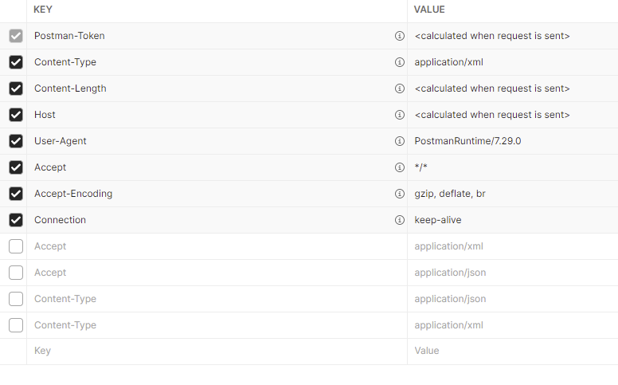
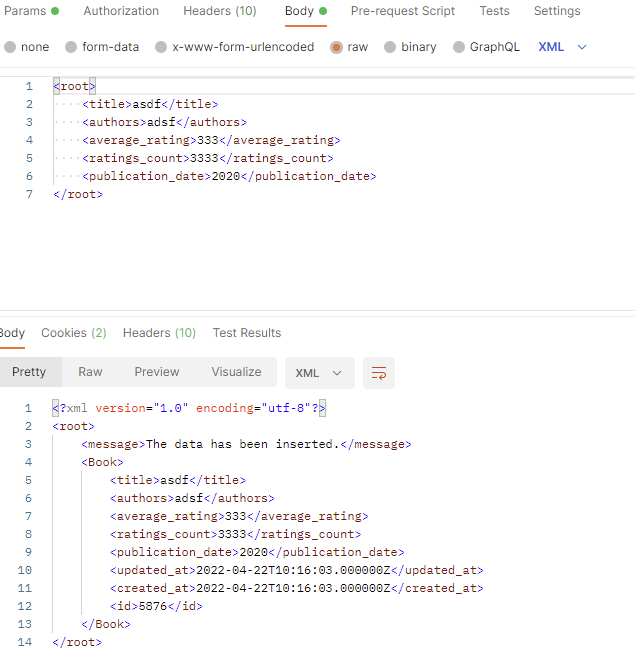
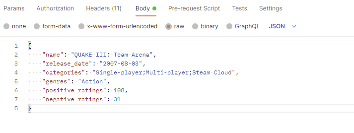
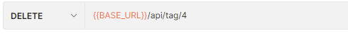

# Ramon_api for movies, games and books.

Finding the correlation between generes within the 3 given objects. the goal is to visualize data and create crud
methods to mutate and validate data.

## Requirements

* PHP 8.1.^
* Composer
* php-mysql

# Installation

install composer

https://getcomposer.org/download/

laravel also has a decent guide for installing.

```composer global require laravel/installer```

# Import project

```git clone https://github.com/Lonely-Taco/ramon_api.git```

## To begin

create a new database called ramon_api

copy the .env.example contents into a new .env file

with proper database username and password

## Run app

in the root folder of the project:

`npm install`

`composer install`

`php artisan migrate:fresh`

### troubleshooting

for windows its possible to require and extension to be enabled on the php.ini

uncomment `extension=gd`

to insert the data into the database run:

`php artisan insert:data`

serve the application;

`php artisan serve`


# Documentation and API

its possible to try the API using the Swagger UI although it its alot slower when fetching large collections.

the GET list method usually takes a couple of minutes.

All testing was done with Postman.

if there are no swagger docs generate docs:

The documetation is in

ramon_api/storage/api_docs/api-docs.json

` php artisan l5-swagger:generate `

http://127.0.0.1:8000/api/documentation

http://127.0.0.1:8000/api/{{endpoint}}

### Data Visualization

* for a better view of the tags, click on the Legend at the top to toggle data on or off for a certain category.


## Making a request

specify in the header whether to accept application/xml or /json as well as the content-type for the request body



## Post request

as shown below, I use the raw field to send xml for the payload and likewise for the json. with respective content-type.


## Patch request

place and object and with its proper content-type header.
]

## deleting any object place the id in the path



# Object examples

## Json:

### Game json

 ```
 {
    "name": "QUAKE III: Team Arena",
    "release_date": "2007-08-03",
    "categories": "Single-player;Multi-player;Steam Cloud",
    "genres": "Action",
    "positive_ratings": 108,
    "negative_ratings": 31
 }
 ```

### Movie json

```
{
    "title": "Willy Wonka & the Chocolate Factory",
    "year": 1971,
    "iMDb": 7.8,
    "runtime": 100
}
```

### Book json

```
{
    "title": "The Duplicate",
    "authors": "William Sleator",
    "average_rating": 3.68,
    "ratings_count": 476,
    "publication_date": 1970
}
```

## XML:

### Game XML

```
<root>
    <name>QUAKE III: Team Arena</name>
    <release_date>2007-08-03</release_date>
    <categories>Single-player;Multi-player;Steam Cloud</categories>
    <genres>Action</genres>
    <positive_ratings>108</positive_ratings>
    <negative_ratings>315555</negative_ratings>
</root>
```

### Movie XML

```
<root>
    <title>Willy Wonka &amp; the Chocolate Factory</title>
    <year>1971</year>
    <iMDb>7.8</iMDb>
    <runtime>100</runtime>
</root>
```

### Book XML

```
<root>
    <title>Interesting book</title>
    <authors>Author</authors>
    <average_rating>10/average_rating>
    <ratings_count>3333</ratings_count>
    <publication_date>2020</publication_date>
</root>
```


