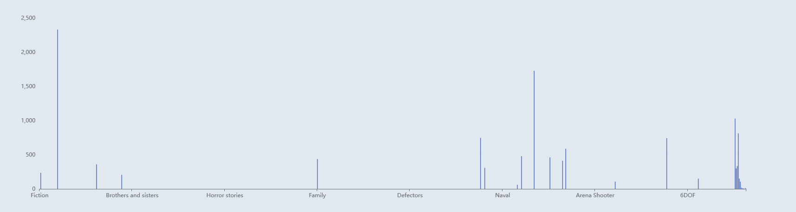

# Ramon_API

Ramon Gonzalez Ordaz

4625544

05/08/2022

# API Design

CRUD endpoints for Games, Movies, and Books

Data is validated with json and xml schemas. Each endpoint returns json and xml.

Consuming application is withing the project itself and the api request process is similar to any other, the only
difference is the URI of the endpoint. Instead of calling the entire https://example.com/api/objects, Laravel knows that
it is trying to call an endpoint within itself and it can be short handed to 'api/object'

Adding the need for a content type header. on the server side, it will be easier to process data if it is known what
type the server is recieving.

The installation guide provides the sample objects that can be used to test the api on Postman and also with the
generated documentation from swagger. Currently, Swagger docs don't support XML objects but there are future plans.

# API and Web Controllers:

In the ```app/Http/Controllers``` directory are the controllers. Normally these would be commented to show the
Implementation of the app but there is a lot of doc-blocks for the swagger docs, and they take most of the space.

The ```app/Validators``` directory contains the validators.

The way I use my validator class is quite simple, with the use of interfaces and abstract classes.

First there is the interface that holds the 3 processing functions for the api, tag, create, and edit. Afterwards it is
implemented to a validator abstract class and lastly to a regular class that extends from the abstract class.

Below is a representation of the class that is created.


Laravel allows for the creation of Singletons classes and with dependency injection provided by
the ```AppServiceProvider``` I can use the same instance of a validator.

All these ambiguous steps ultimately allow me to use and reference interface instances instead of an entire class.

Below I create a validator instance for and XML game validator and pass its respective schema and class I will be using.


To save from as much duplicate code and save from the headache of fixing 3 different validators I use the
same ```JsonValidator``` or ```XmlValidator``` class for all the controllers.

# Data Visualization

Laravel Chartisan was used to create some bar graphs that will represent the correlation in games, movies, books. Using tags as the most common denominator some graphs can be displayed to show the Tags some objects have in common.

*for a better view of the tags, click on the Legend at eh top to toggle data on or off for a certain category.





